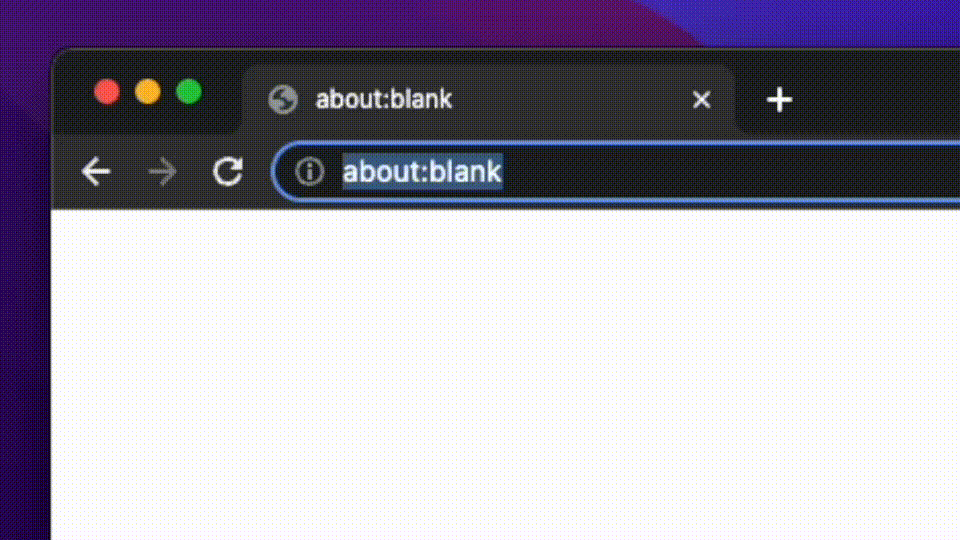

# repo.events

This project fetch recent activities from a github repository and display them nicely, so you can see what's happening in 
the repositories at a glance.

Enter `repo.events/{owner}/{repo}` into your browser address bar to see activities from the repository. For example [repo.events/golang/go](https://repo.events/golang/go)

A browser extension that brings the activity page to you right at github's repository page is coming soon, stay tuned!